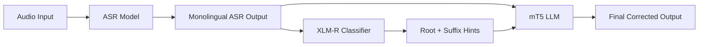

# Enhanced ASR for Tamil–English Code-Switching with Morphological Suffixes

A research and development project focused on automatic speech recognition (ASR) for **Tamil–English code-switching** speech, with special handling of **Tamil morphological suffixes** attached to English words.

## Overview

In natural Tamil–English mixed speech, speakers often:

- Use **Tamil words in Tamil script** (e.g., `நான்`, `போக`)
- Use **English words in English letters** (e.g., `office`, `meeting`)
- Attach **Tamil morphological suffixes** to English roots (e.g., `office-ikku`, `meeting-la`, `call-pannan`)

Standard monolingual ASR models struggle with this pattern because they are not trained to recognize English roots with Tamil suffixes. This project builds a multi-stage pipeline that combines ASR fine-tuning, morphological classification, and hint-guided text correction.

## Problem Statement

| Aspect | Description |
|--------|-------------|
| **Languages** | Tamil + English code-switching |
| **Script** | Tamil in Tamil letters; English in English letters |
| **Key challenge** | English words followed by Tamil morphological suffixes (`-ikku`, `-la`, `-a`, etc.) |
| **Goal** | Accurate transcription of mixed Tamil–English speech with correct suffix attachment |

## Pipeline Architecture



The system works in three main stages:

1. **ASR** — Transcribe audio using a fine-tuned Whisper-based model (LoRA).
2. **Morphological hinting** — Use XLM-R to predict the correct English root and Tamil suffix for suspicious tokens.
3. **Hint-guided correction** — Feed the ASR output and XLM-R hints into mT5 to produce the final transcript.

## Models Used

### ASR Models (Candidate Selection)

| Model | Description |
|-------|-------------|
| **Whisper Large v3** | `openai/whisper-large-v3` — multilingual baseline |
| **Vassista Tamil** | `vasista22/whisper-tamil-large-v2` — monolingual Tamil model trained on Whisper Large v2; in practice it behaves mostly as a monolingual Tamil ASR |

### Downstream Models

| Model | Role |
|-------|------|
| **XLM-R Large** | Dual-head classifier that predicts **English root** and **Tamil suffix** for code-switched tokens |
| **mT5 Large** | Seq2seq language model that refines ASR output using XLM-R hints |

## Workflow

### Step 1 — Data Preparation

- Collect and clean a Tamil–English **code-switching (CS)** dataset.
- Remove background music (BGM) from audio where needed.
- Prepare audio–text pairs for training and evaluation.

**Notebook:** `DataCleaning.ipynb`, `BGM REMOVER.ipynb`

### Step 2 — Zero-Shot Evaluation

Run zero-shot inference on the CS test set with both candidate ASR models and compute metrics (WER, CER).

| Model | Notebook |
|-------|----------|
| Whisper Large v3 | `Zero shot for Whisper large V3.ipynb` |
| Vassista Tamil (Whisper Large v2) | `zeroshot_for_Vassista.ipynb` |

This establishes baseline performance before fine-tuning.

### Step 3 — Fine-Tune ASR with LoRA

Fine-tune the selected model(s) on the collected CS dataset using **LoRA** (Low-Rank Adaptation) for parameter-efficient training. Multiple experiments are run; the **best-performing fine-tuned model** is selected for downstream use.

### Step 4 — Train XLM-R Dual-Head Classifier

Train an XLM-R Large model with two classification heads:

- **Root head** — predicts the correct English root word
- **Suffix head** — predicts the corresponding Tamil morphological suffix

The classifier is trained on token-level examples where the ASR output differs from the expected token (e.g., wrong root or wrong suffix).

**Notebook:** `XLM-R.ipynb`

**Example suffixes:** `-ikku`, `-la`, `-a`, `-um`, and similar Tamil case/postpositional markers.

### Step 5 — Train mT5 with Hints

Train mT5 Large (with LoRA) to correct ASR transcripts. Each training example pairs:

- **Input:** monolingual ASR output + XLM-R hint string
- **Target:** ground-truth corrected transcript

Hint format example:

```
fix tamil-english: <ASR output> || hints: <token>=><corrected_token> ; ...
```

**Notebooks:** `Train MT5 with hints.ipynb`, `mT5.ipynb`, `merging mT5 and lora adapter value.ipynb`

### Step 6 — End-to-End Hint-Based Inference

Run the full pipeline on new audio:

1. Transcribe with the fine-tuned ASR model (LoRA-merged Whisper).
2. Detect suspicious tokens and generate root/suffix hints with XLM-R.
3. Pass ASR text + hints to mT5 for final correction.

**Notebook:** `hint based approch.ipynb`

## Evaluation & Analysis

The project tracks metrics at each stage:

| Stage | Metrics |
|-------|---------|
| ASR (zero-shot & fine-tuned) | WER, CER |
| XLM-R classifier | Root accuracy, suffix accuracy, joint accuracy, suffix macro F1 |
| mT5 (with hints) | WER, CER vs. reference |
| Suffix-specific | Suffix attachment accuracy |

**Analysis notebooks:**

- `Analysis of Output.ipynb` — compare pipeline outputs
- `Suffix accuarrcy check.ipynb` — suffix-level accuracy
- `Englis-Tamil miss recognized.ipynb` — English→Tamil misrecognition patterns
- `Error tamil-tamil Analysis.ipynb` — Tamil–Tamil error analysis
- `ASR and XML-R merged.ipynb` — combined ASR + XLM-R evaluation
- `xlmr and newly trained asr .ipynb` — XLM-R with updated ASR outputs

## Project Structure

```
.
├── README.md
│
├── # Data preparation
├── DataCleaning.ipynb
├── BGM REMOVER.ipynb
│
├── # ASR — zero-shot evaluation
├── Zero shot for Whisper large V3.ipynb
├── zeroshot_for_Vassista.ipynb
│
├── # ASR — fine-tuning (LoRA) & analysis
├── Suffix accuarrcy check.ipynb
├── Englis-Tamil miss recognized.ipynb
├── Error tamil-tamil Analysis.ipynb
│
├── # XLM-R morphological classifier
├── XLM-R.ipynb
├── ASR and XML-R merged.ipynb
├── xlmr and newly trained asr .ipynb
│
├── # mT5 hint-guided correction
├── mT5.ipynb
├── mT5 with token trained.ipynb
├── Train MT5 with hints.ipynb
├── merging mT5 and lora adapter value.ipynb
│
├── # End-to-end pipeline
├── hint based approch.ipynb
└── Analysis of Output.ipynb
```

## Key Design Decisions

- **LoRA for ASR fine-tuning** — Efficient adaptation of large Whisper models without full fine-tuning.
- **Dual-head XLM-R** — Separates root and suffix prediction, which maps directly to the morphological structure of code-switched tokens.
- **Hint-guided mT5** — Uses classifier output as explicit hints rather than relying on mT5 alone, improving correction of suffix attachment errors.
- **Monolingual ASR as first pass** — The fine-tuned Tamil-oriented ASR produces an initial transcript; XLM-R and mT5 then fix code-switching and suffix errors.

## Requirements

Notebooks are designed to run in **Google Colab** with GPU access. Core dependencies include:

- `transformers`, `datasets`, `accelerate`
- `peft` (LoRA / AdaLoRA)
- `jiwer` (WER/CER)
- `torch`, `torchaudio`, `librosa`, `soundfile`
- `scikit-learn`, `pandas`, `numpy`

Model weights and datasets are stored on Google Drive and referenced via Colab mount paths inside the notebooks.

## License

Research and development project. Add a license here if you plan to open-source the work.
